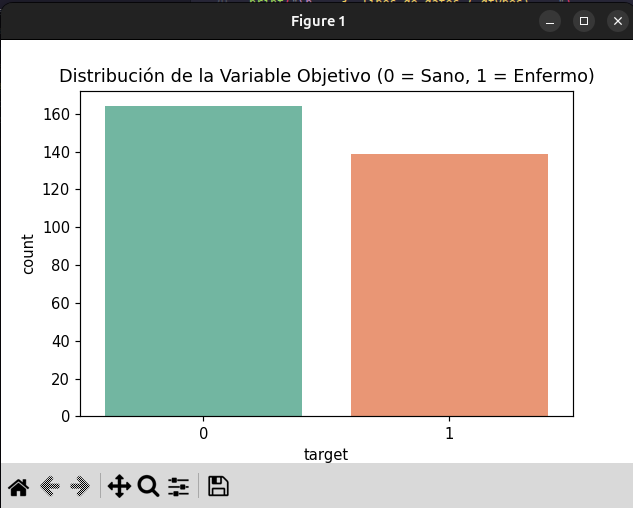
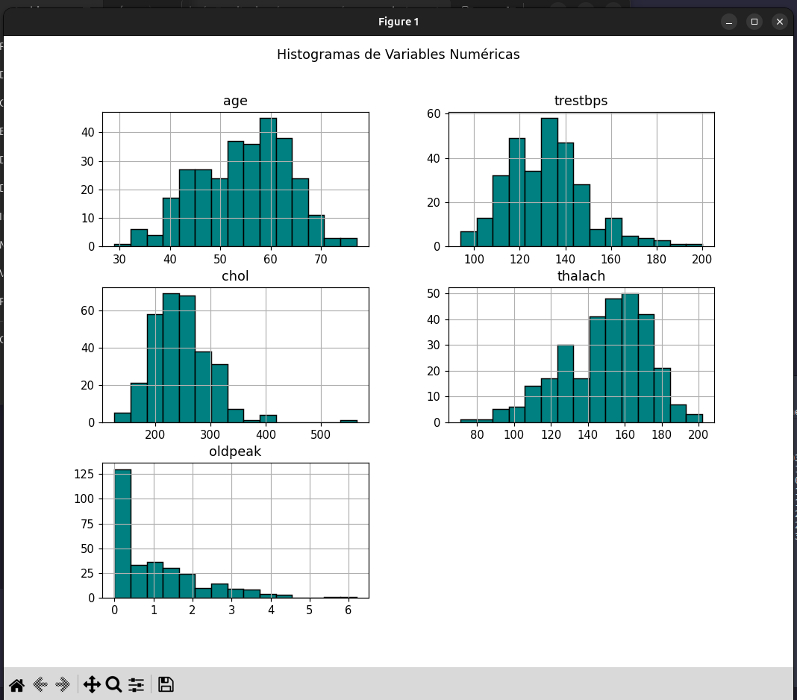
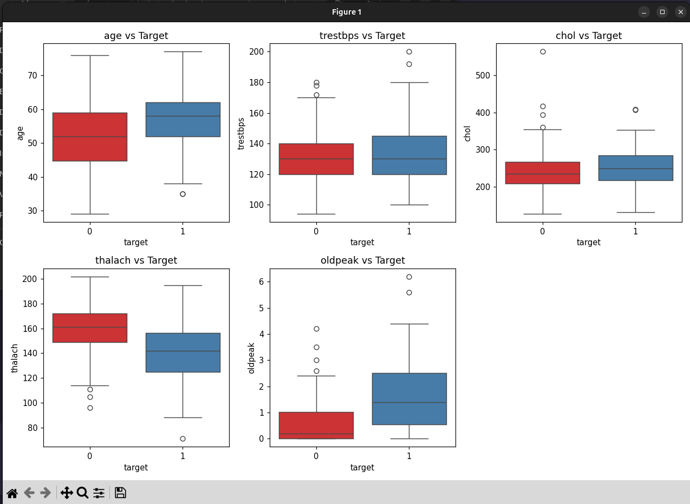
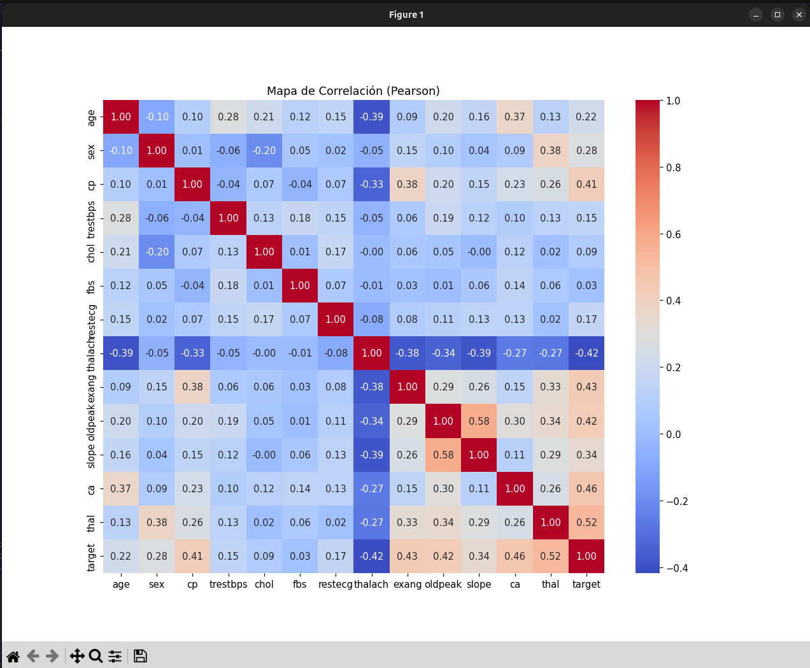
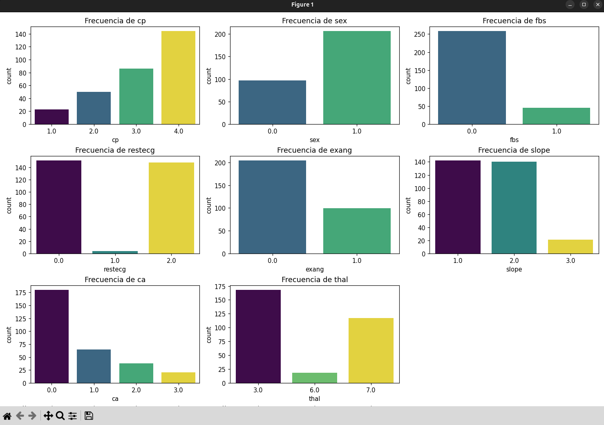
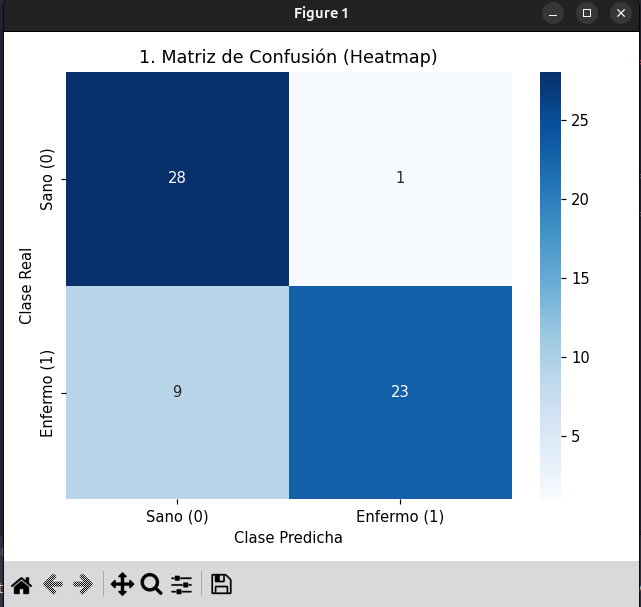
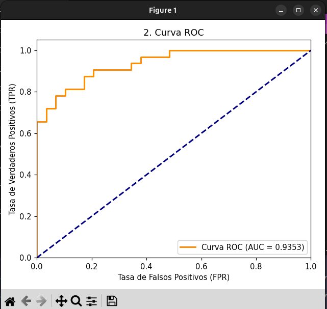
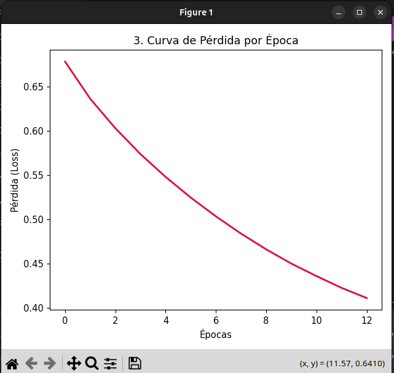
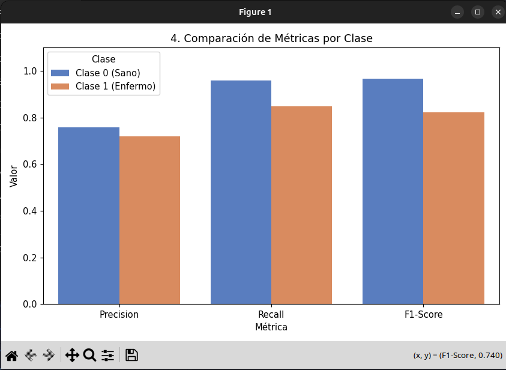

# Clasificación de Enfermedad Cardíaca con Redes Neuronales (MLP)
Implementación de un pipeline de Inteligencia Artificial para la predicción de enfermedades cardíacas mediante un modelo de Perceptrón Multicapa.

**Alumno:** Juan Iran Lopez Mercado
**Matrícula:** [21760719]

## 1. Descripción del Dataset y Problema
El dataset Heart Disease proviene del UCI Machine Learning Repository y contiene información clínica de pacientes (edad, presión arterial, colesterol, etc.) para predecir la presencia o ausencia de enfermedad cardíaca. Es un problema de clasificación binaria (0 = Sano, 1 = Enfermo).

## 2. Instrucciones de Instalación
Para replicar el entorno y las dependencias del proyecto, ejecuta en la terminal:

pip install -r requirements.txt

## 3. Instrucciones de Ejecución
Ejecuta los siguientes scripts en el orden indicado:
1. python heart_disease_eda.py : Realiza el análisis exploratorio de datos y genera las visualizaciones.
2. python mlp_training.py : Preprocesa los datos, entrena la Red Neuronal, guarda el modelo serializado en la carpeta models/ y evalúa el rendimiento.

## 4. Análisis Exploratorio de Datos (EDA) - Hallazgos

* Distribución de la Variable Objetivo (Paso 3.2):
El dataset presenta un balance adecuado para el entrenamiento del modelo, sin un desequilibrio extremo entre las categorías. Esto permite que la red neuronal aprenda las características de ambas clases (sano y enfermo) sin sesgarse hacia una sola.

* 1. Histogramas de variables numéricas:
Variables como la edad (age) muestran una distribución que tiende a la normalidad, concentrando a la mayoría de los pacientes entre los 50 y 60 años. Por otro lado, el colesterol (chol) y la presión arterial (trestbps) presentan un sesgo hacia la derecha, evidenciando algunos valores atípicos (outliers) muy altos en ciertos pacientes.

* 2. Countplots de variables categóricas:
Se observa una frecuencia considerablemente mayor de pacientes de sexo masculino (sex=1) en la muestra analizada. Asimismo, la inmensa mayoría de los individuos registrados tienen un nivel de azúcar en ayunas (fbs) por debajo de los 120 mg/dl, lo que indica que esta condición específica no es predominante.

* 3. Boxplots por clase objetivo:
Existen diferencias notables en la distribución de la frecuencia cardíaca máxima (thalach) dependiendo del diagnóstico, mostrando medianas distintas entre pacientes sanos y enfermos. En contraste, variables como la presión arterial en reposo (trestbps) muestran cajas y bigotes muy similares para ambas clases, sugiriendo que por sí sola no separa claramente a los grupos.

* 4. Mapa de correlación (Heatmap):
El tipo de dolor de pecho (cp) y la angina inducida por el ejercicio (exang) muestran los coeficientes de correlación más significativos respecto a la presencia de enfermedad cardíaca. Por el contrario, el nivel de azúcar (fbs) y el colesterol (chol) presentan una correlación lineal muy cercana a cero con la variable objetivo, indicando un menor peso predictivo directo.

## 5. Arquitectura del Modelo
* Modelo: Perceptrón Multicapa (MLPClassifier)
* Capas ocultas: 2 capas (100 neuronas y 50 neuronas)
* Función de activación: ReLU
* Optimizador: Adam
* Parámetros adicionales: max_iter=500, early_stopping=True, random_state=42

## 6. Resultados del Entrenamiento (Métricas)
Tabla resumen de rendimiento sobre el conjunto de prueba (20%):

| Métrica   | Valor obtenido |
| :---      | :---           |
| Accuracy  | [Ej. 0.85]     |
| Precision | [Ej. 0.84]     |
| Recall    | [Ej. 0.86]     |
| F1-Score  | [Ej. 0.85]     |
| AUC       | [Ej. 0.90]     |

### 6.1 Gráficas de Evaluación del Modelo (Sección 4.4)

* 1. Matriz de Confusión (Heatmap):
Permite observar los verdaderos positivos y negativos frente a los errores del modelo. [Ej. Se observa que el modelo tiene una alta tasa de Verdaderos Positivos, minimizando los Falsos Negativos, lo cual es crucial en diagnósticos médicos].

* 2. Curva ROC:
Muestra la capacidad de diagnóstico del modelo. [Ej. La curva se acerca a la esquina superior izquierda, logrando un Área Bajo la Curva (AUC) de X.XX, lo que indica una excelente separabilidad entre clases].

* 3. Curva de Pérdida (loss_curve_):
Visualiza la evolución del error durante el entrenamiento. [Ej. La pérdida disminuye de forma logarítmica y se estabiliza antes de las 500 épocas gracias al early_stopping, lo que demuestra que el optimizador Adam convergió correctamente].

* 4. Barplot de Métricas por Clase:
Compara visualmente el desempeño (Precision, Recall y F1) para sanos y enfermos. [Ej. Las barras demuestran un rendimiento equilibrado, aunque el Recall para la clase 1 (enfermos) es ligeramente superior].

## 7. Análisis e Interpretación de Resultados

* ¿Qué tan bien generaliza el modelo? ¿Hay indicios de overfitting o underfitting?
[ Ej. El modelo generaliza correctamente al tener un accuracy alto en los datos de prueba. La curva de pérdida desciende de forma estable, lo que descarta un overfitting severo.]

* ¿Cuál clase se predice mejor (0 o 1) y por qué crees que ocurre esto?
[ Ej. La clase X se predice ligeramente mejor (mayor F1-Score), posiblemente debido a la distribución de las muestras o características particulares durante el entrenamiento.]

* ¿Qué variables del EDA considera más relevantes para la predicción del modelo?
De acuerdo con el análisis del mapa de correlación, las variables cp (tipo de dolor de pecho) y thalach (frecuencia cardíaca máxima) son las más relevantes para la predicción.

* ¿Qué cambio en la arquitectura o parámetros del MLP crees que mejoraría el desempeño?
[  Modificar hiperparámetros como aumentar el número de épocas, ajustar la tasa de aprendizaje o agregar regularización (alpha) podría mejorar ligeramente el rendimiento general.]
